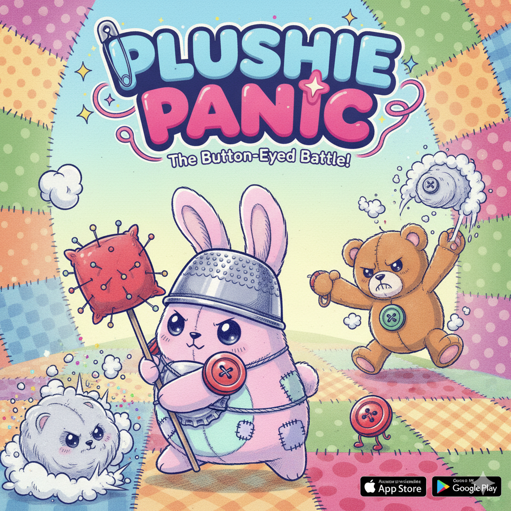
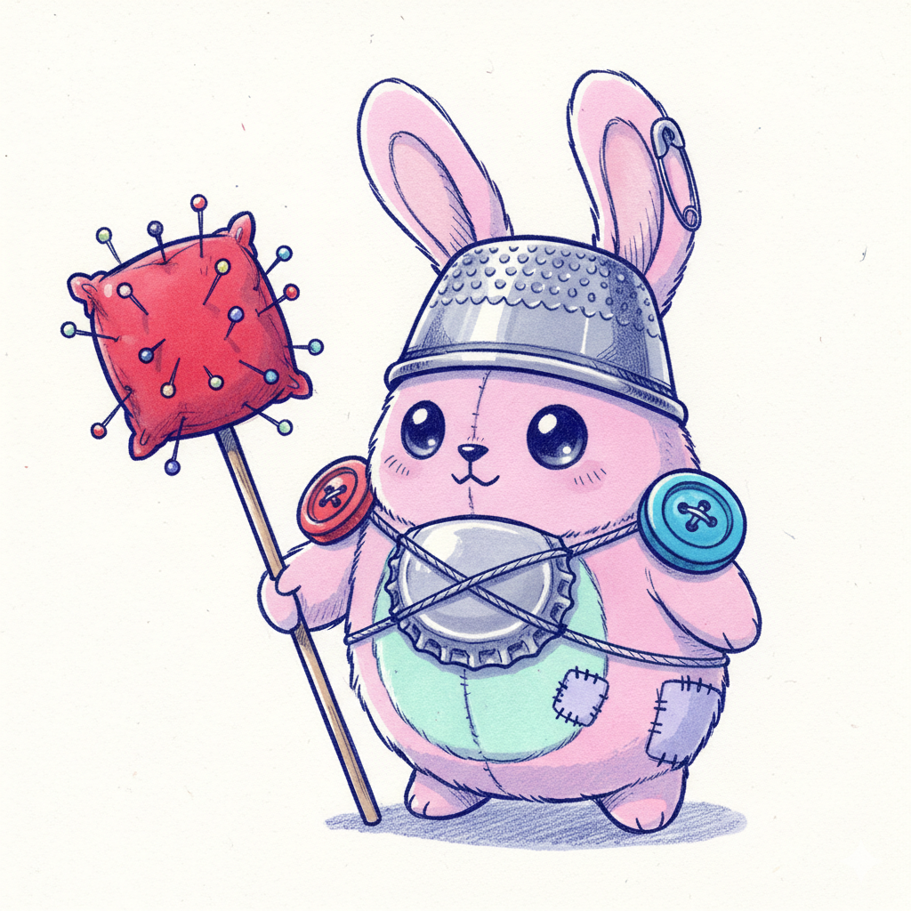
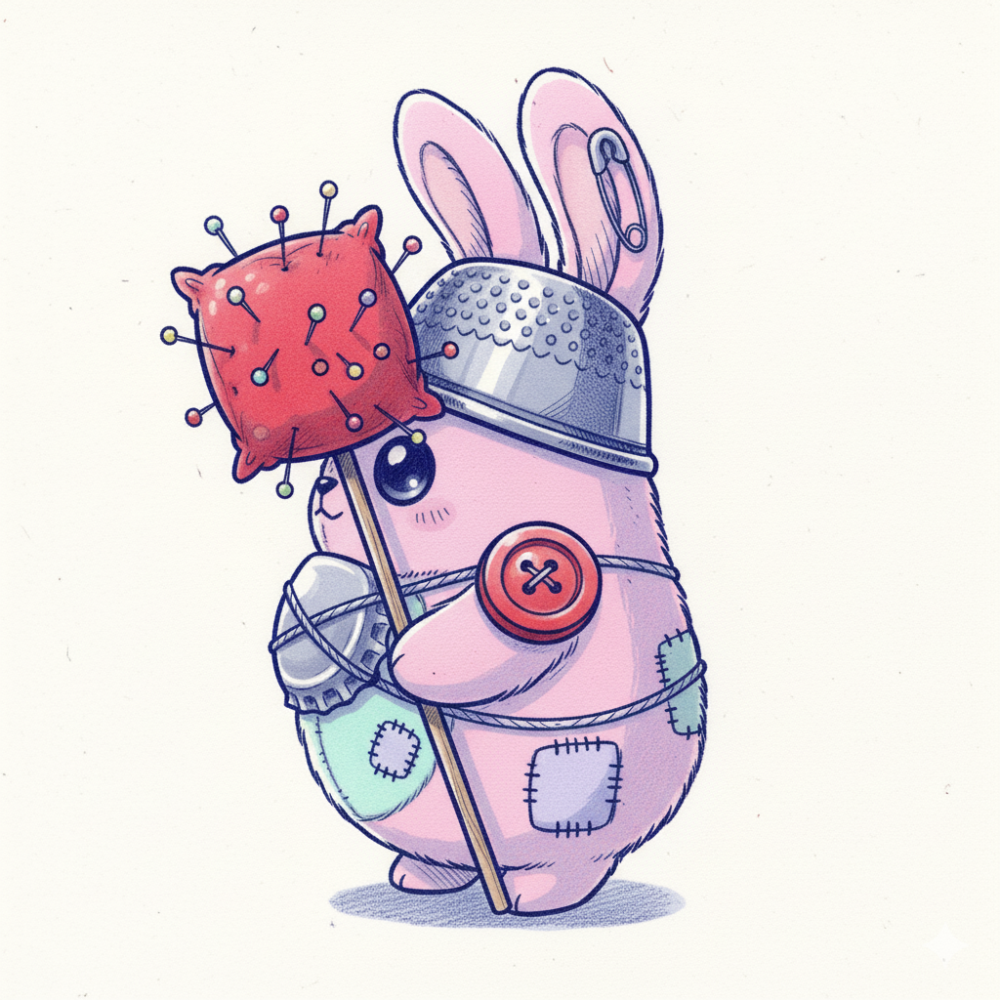
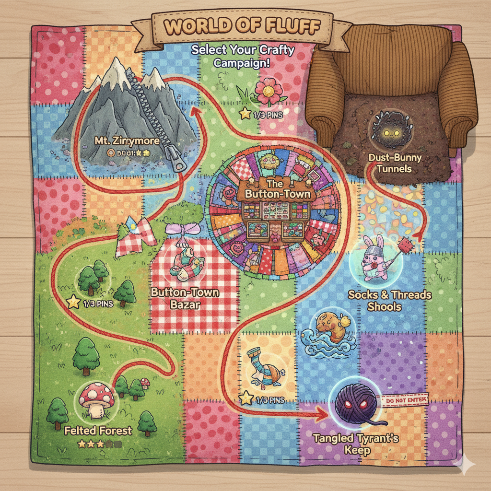
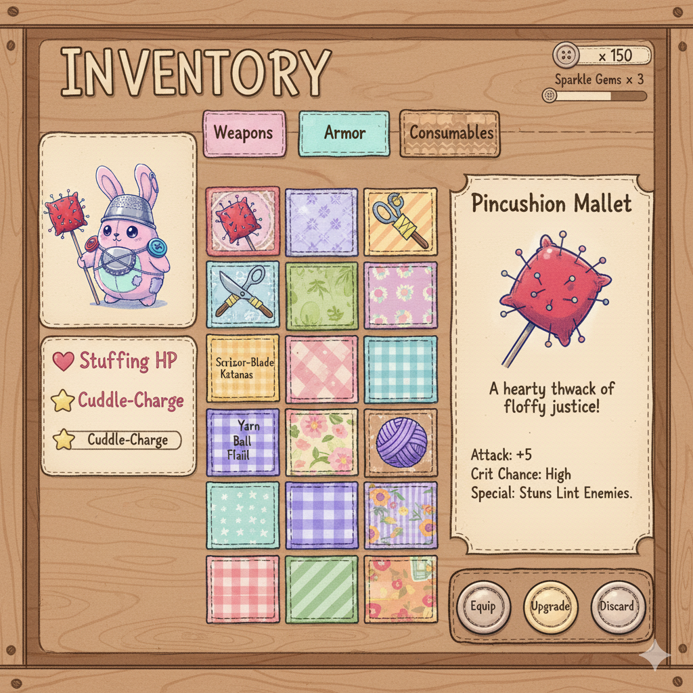

# Plushie-Panic

____

* Refining the Concept *

_ ` cutie Gemini says "I'm currently fleshing out the 'kawaii hack and slash' concept.  The focus now is on defining key visual elements and gameplay mechanics that will create a charming yet action-packed experience.  I'm exploring potential enemy designs and level design to see how to incorporate the "cute" aesthetic with intense combat"

* Evolving Enemy Designs *

_ ` cutie Gemini says "I'm now diving into the enemy roster for the "kawaii hack and slash." I'm brainstorming how to make them visually appealing but still challenging. I'm moving away from typical "cute" tropes and looking for unique, quirky designs that mesh well with the fast-paced gameplay. I'm also considering attack patterns and behaviors that will give the player interesting combat scenarios"

* Expanding the Lore *

_ ` cutie Gemini says "I'm now focusing on weaving the "kawaii" aesthetic into the story and world of the game. I'm imagining the backstory for the Kingdom of Sweet-Topia and its current plight. What led to the Sourdough Soldiers' grumpy uprising?  How can Kiki, the Cupcake Knight, bring sweetness back? I'm exploring character interactions and quest ideas to enrich the gameplay experience"

* Developing Level Design *

_ ` cutie Gemini says "I'm now focusing on how the world itself in this "kawaii hack and slash" will amplify the game's energy. I'm exploring environments that will provide fun combat arenas while staying within the "Sweet-Topia" theme.  I'm brainstorming how to combine visually striking environments, interesting level layouts, and interactive elements to create a dynamic gaming experience, with different areas focusing on sugar rushes and other fun concepts"

* Defining the Gameplay *

_ ` cutie Gemini says "The current focus is solidifying the mechanics for my "kawaii hack and slash."  I'm striving to create a fluid and responsive combat system that remains fun and engaging while being easy to pick up. I'm imagining power-ups that will let me transform my character, like temporarily growing larger and dealing more damage. The goal is to make a game where strategy blends seamlessly with fast action, ensuring replayability and hours of fun"

* Expanding the Combat *

_ ` cutie Gemini says "I'm now thinking about how to make the combat in my "kawaii hack and slash" feel satisfying and impactful. I'm exploring different weapon types, like a lollipop lance or a candy cane claymore, each with unique attack patterns and combo possibilities.  I'm also considering special moves or power-ups, maybe a "Sugar Rush" mode where Kiki becomes temporarily invulnerable, or perhaps has a burst attack that turns enemies into adorable, harmless pastries"

* Exploring Visual Styles *

_ ` cutie Gemini says "I'm now sketching out visual styles for the game, combining cute character designs with the intensity of combat. The goal is to design a visual vocabulary that creates a unique and appealing blend of visual cues, like the enemy designs with their distinctive appearance. I'm exploring bright colors, exaggerated features, and dynamic animations to make this blend a reality"
